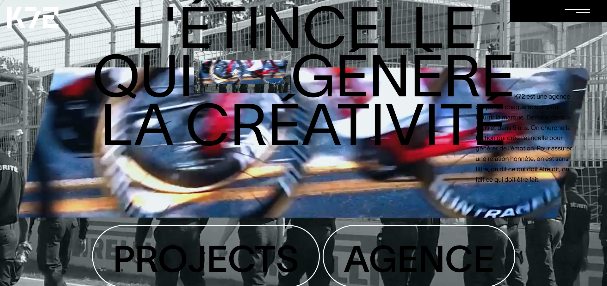

# 🚀 K72 — Animated Website

A modern animated landing page built with **ReactJS, Tailwind CSS, and GSAP**, designed to showcase smooth microinteractions, responsive layouts, and motion-first UI components.

---

## ✨ Features

- ⚡ Fast & modular with **React + Vite**  
- 🎨 Styled using **Tailwind CSS**  
- 🎞️ Smooth animations with **GSAP (GreenSock Animation Platform)**  
- 📱 Fully responsive design  
- 🌌 Animated hero, buttons, and scroll-reveal sections  
- 🔧 Easy customization for branding and content  

---

## 🧰 Tech Stack

- **ReactJS** — UI components  
- **Tailwind CSS** — styling framework  
- **GSAP** — animation library  
- **Vite** — development server & build tool  

---

## 📂 Project Structure

k72/
│── public/                # Static files
│── src/
│    ├── assets/           # Images, icons, media
│    ├── components/       # UI components (Hero, Navbar, Footer, etc.)
│    ├── context/          # React Context (Theme, Animation, Global State)
│    ├── pages/            # Page-level components
│    ├── App.jsx           # Root app component
│    ├── main.jsx          # React entry file
│    └── index.css         # Global Tailwind styles
│── package.json
│── tailwind.config.js
│── vite.config.js
│── README.md

---

## 🛠️ Getting Started
1. Clone the repository
git clone https://github.com/palak720/k72.git
cd k72

## 2. Install dependencies
npm install

## 3. Run the development server
npm run dev

Open http://localhost:5173/
 in your browser.

 ---

 ## 📸 Screenshots / Demo

### Hero Section

### Animation Demo

---

## 👤 Author

[GitHub](palak720)

[Live Demo](https://k72-d8bd47.netlify.app/)
---
